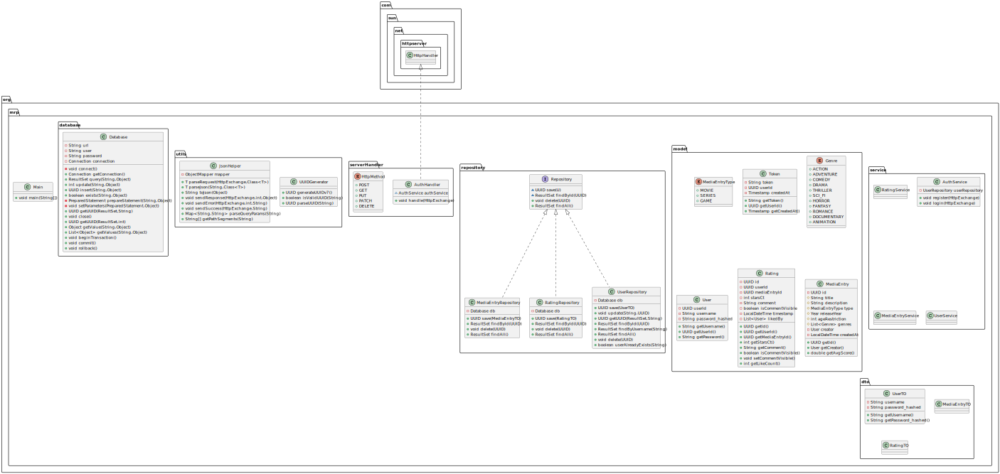

# Semester-Projekt: Media Ratings Platform (MRP)

## Projektbeschreibung


Die **Media Ratings Platform (MRP)** ist ein REST-basierter Java-HTTP-Server, der als Backend für mögliche Frontends (z.B. Web, Mobile, CLI) dient. Die Anwendung ermöglicht es Usern, Medieninhalte wie Filme, Serien oder Spiele zu erstellen, zu bewerten und zu verwalten.

> **Hinweis:** Es handelt sich um eine **standalone Java-Anwendung**. Die Implementierung nutzt `HttpServer` und speichert Daten in einer **PostgreSQL-Datenbank**.


## Technologien & Tools

| Komponente          | Technologie                         |
|---------------------|-------------------------------------|
| Programmiersprache  | Java (JDK 24)                       |
| HTTP-Server         | `com.sun.net.httpserver.HttpServer` |
| JSON-Serialisierung | Jackson (`com.fasterxml.jackson`)   |
| Datenbank           | PostgreSQL 16 (mit Docker)          |
| Authentifizierung   | Token-basierte Auth                 |
| API Testing         | Postman Collection                  |
| Build Tool          | Maven                               |


## Architektur & Designentscheidungen

### 1. Projektstruktur

```plaintext
📦 src/
├── 📁 database/          → Verwaltung PostgreSQL-Datenbankverbindung
├── 📁 model/             → Datenmodelle (User, MediaEntry, Rating)
├── 📁 repository/        → Datenbankzugriffe (DAO/Repository Pattern)
├── 📁 serverHandler/     → HTTP-Endpunkte & Request-Routing
├── 📁 service/           → Business-Logik
├── 📁 utils/             → Helferklassen
└── Main.java             → Einstiegspunkt & Server-Initialisierung
```

### 2. Architekturprinzipien

#### Layered Architecture

Die Anwendung folgt der **Schichten-Architektur** mit folgenden Layern zur Trennung von Verantwortlichkeiten:

- **Handler-Schicht:**  
  Zuständig für die Verarbeitung eingehender HTTP-Anfragen.  
  Die Schicht enthält das Bereitstellen der Endpoints der Anwendung, Auswerten der Anfrage (z. B. HTTP-Methode und Pfad) aus und Aufrufen der passende Service-Methode.
  Außerdem kümmert sie sich um das Senden von HTTP-Antworten (z. B. JSON-Ausgaben, Fehlercodes) – die direkte Arbeit mit dem HttpExchange findet ausschließlich hier statt.
  Sie enthält keine Business-Logik, sondern dient als Vermittler zwischen HTTP-Interface und Service-Schicht.  
  Beispiele: `AuthHandler`, `MediaEntryHandler`.

- **Service-Schicht:**  
  Enthält die Kernlogik (Business-Logik). Führt Validierungen durch, steuert den Ablauf und verarbeitet Daten.  
  Beispiele: `UserService`, `AuthService`.

- **Model-Schicht:**  
  Repräsentiert Datenbank-Entitäten. Wird von der Repository-Schicht verwendet.
  Beispiele: `User`, `MediaEntry`, `Rating`.

- **Repository-Schicht:**  
  Verantwortlich für die Kommunikation mit der PostgreSQL-Datenbank. Implementiert Create/Read/Update/Delete (CRUD) Methoden.  
  Beispiele: `UserRepository`, `MediaEntryRepository`.

Diese Schichtung macht den Code modular, leicht testbar und wartbar.

Zudem gibt es ebenfalls Packages für:

- **Server-Handler**  
  Das `serverHandler`-Package enthält alle Klassen, die als zentrale **Ansprechpartner für HTTP-Anfragen** fungieren. Jede Handler-Klasse ist einer oder mehreren spezifischen Routen (Endpoints) zugeordnet und wird direkt vom Server bei eingehenden Requests aufgerufen.  
  Zum Beispiel: `AuthHandler`

- **Utils**  
  Das `utils`-Package enthält **Hilfsklassen**, die allgemeine, wiederverwendbare Funktionen bereitstellen und **nicht direkt zur Geschäftslogik** gehören. Diese Klassen unterstützen andere Schichten (Handler, Service, Repository) und sorgen für sauberen, wartbaren Code.

- **Database**  
  Das `database`-Package enthält die zentrale Datenbankklasse, die für die **Verwaltung der Verbindung zur PostgreSQL-Datenbank** verantwortlich ist.  


### 3. Token-basierte Authentifizierung

Für die Autorisierung wird ein **Token-basiertes Authentifizierungssystem** verwendet:

- Nach dem Login wird ein eindeutiger Token generiert.
- Dieser Token wird in der Datenbank in Bezug zu dem User gespeichert.
- Bei einer erneuten Anmeldung des Users wird sein Token in der Datenbank überschrieben.


### 5. UML

Zur besseren Darstellung der Systemarchitektur zeigt das folgende UML-Diagramm die zentralen Komponenten und Layer und deren Interaktionen.




## Endpoints

Folgend eine Liste aller im Projekt relevanten Endpoints:

| Methode | Endpoint                      | Beschreibung                         |
|---------|-------------------------------|--------------------------------------|
| POST    | `/register`                   | Registrierung                        |
| POST    | `/login`                      | Login & Token erhalten               |
| GET     | `/mediaEntry`                 | Liste aller Medieninhalte            |
| POST    | `/mediaEntry`                 | Neues Medium erstellen               |
| PUT     | `/mediaEntry/{id}`            | Medium bearbeiten (nur Creator)      |
| DELETE  | `/mediaEntry/{id}`            | Medium löschen                       |
| POST    | `/mediaEntry/{id}/favorite`   | Medium als Favorite markieren        |
| DELETE  | `/mediaEntry/{id}/favorite`   | Medium aus Favorites entfernen       |
| POST    | `/rating/{id}`                | Bewertung erstellen                  |
| PUT     | `/rating/{id}`                | Bewertung bearbeiten                 |
| DELETE  | `/rating/{id}`                | Bewertung löschen                    |
| POST    | `/rating/{id}/like`           | Bewertung liken                      |
| POST    | `/rating/{id}/unlike`         | Bewertung nicht mehr liken           |
| POST    | `/rating/{id}/confirm`        | Rating-Kommentar öffentlich schalten |
| GET     | `/users/{username}/profile`   | Profil mit Statistiken               |
| GET     | `/users/{username}/favorites` | Userspezifische Favoriten            |
| GET     | `/users/{username}/ratings`   | Userspezifische Bewertungen          |
| GET     | `/users/leaderboard`          | Leaderboard eines Users              |
| GET     | `/users/recommendations`      | Empfehlungsfunktion                  |


## Testing

Da in diesem Projekt **Integrationstests mit einer Postman Collection** verwendet wurden, deckt die Teststrategie folgende Punkte ab:

### Testabdeckung
| Bereich               | Abgedeckt durch Postman Tests |
|-----------------------|-------------------------------|
| Registrierung / Login | ✅                             |
| Authentifizierung     | ✅                             |
| Profil                | *Noch ausstehend*             |
| CRUD Media            | ✅                             |
| Ratings               | ✅                             |
| Likes                 | ✅                             |
| Favoriten             | ✅                             |
| Leaderboard           | ✅                             |
| Recommendations       | *Noch ausstehend*             |
| Fehlerfälle (4xx/5xx) | ✅                             |

**Postman Collection Inhalt von `MRP-IntegrationTests`:**
- `01_Authentication.postman_collection.json`: Registration und Login
- `02_MediaEntry-CRUD.postman_collection.json`: Create, Update, Read, Delete
- `03_Favorites.postman_collection.json`: Add, Remove, Get User's Favorites
- `04_Ratings.postman_collection.json`: Comment-Visibility, Like/Unlike, Create, Update, Delete User-Ratings zu Media Entries
- `05_Leaderboard.postman_collection.json`: User-Rankings basierend auf den Likes ihrer Media Entries
- *Weitere Tests folgen im Laufe des Projektes*

Die Tests werden manuell in Postman ausgeführt.


## Zeitaufwand (geschätzt)

*Nachdem es sich hierbei um die Zwischenabgabe handelt, sind ausschließlich bereits erledigte Aufgaben zeitlich geschätzt:*

| Aufgabe                                 | Stunden |
|-----------------------------------------|---------|
| Setup (Projekt-Grundgerüst, DB, Docker) | 20 h    |
| User Authentifizierung                  | 5 h     |
| Media-Entry CRUD                        | 18 h    |
| Ratings + Comments + Likes              | 15 h    |
| Sortieren + Filter                      |         |
| Favoriten                               | 5 h     |
| Empfehlungen                            |         |
| Leaderboard                             | 2 h     |
| Postman Tests & Debugging               |         |
| Dokumentation (README & Protocol)       |         |
| **Gesamt**                              | 65 h    |


## Probleme & Lösungen

Im bisherigen Projektverlauf sind keine gravierenden technischen Probleme aufgetreten.
Einige Punkte, die potenziell fehleranfällig wären, konnten durch saubere Planung und Strukturierung vermieden werden:

- **Datenbankverbindung:**  
  Die Verwendung einer zentralen `Database`-Klasse im `database`-Package führt dazu, dass die Verbindung stabil und übersichtlich bleibt, ohne Probleme mit mehreren Verbindungen.

- **Routen-Handling:**  
  Eine konsistente Struktur der Handler sorgt für Übersichtlichkeit und einfache Erweiterbarkeit.

